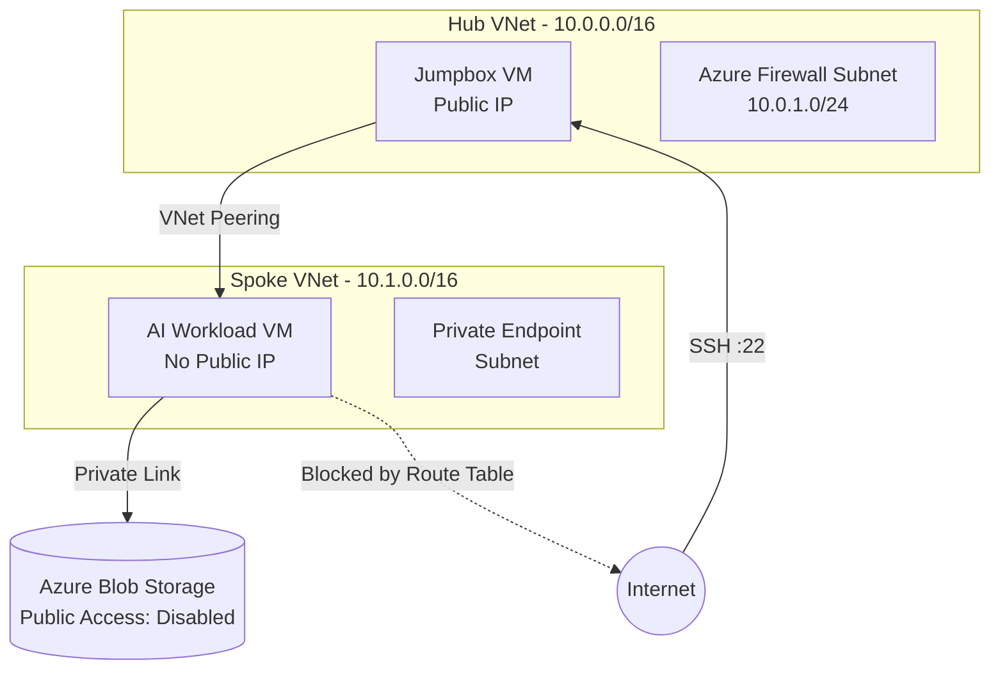

# Secure Air-Gapped AI Infrastructure on Azure


An enterprise-grade, Zero-Trust network topology deployed on Microsoft Azure using Terraform. This architecture is specifically designed to host sensitive AI workloads (LLMs) in a completely isolated (Air-Gapped) environment, ensuring no public internet exposure and secure data transfer via Azure Private Link.

## 🏗️ Architecture & Topology

The infrastructure strictly follows the Microsoft Well-Architected Framework's **Hub-Spoke** model.



## ✨ Engineering Highlights

### 1. Zero Local Dependencies (Dynamic SSH)
The deployment relies on **zero** pre-existing local SSH keys (`id_rsa.pub`). Terraform dynamically generates RSA-4096 keys during deployment (`tls_private_key`) and stores the private keys securely in the Terraform State. This enables true "One-Click Deploy" and ensures CI/CD pipeline compatibility.

### 2. Strict Air-Gapped Isolation (Zero Outbound)
The AI Workload VM resides in an isolated subnet. A Route Table forces all outbound traffic (`0.0.0.0/0`) to a Hub Firewall IP (`10.0.1.4`). Because of this Forced Tunneling, the AI VM has **no internet access**. All necessary Python libraries (`.whl`) and AI models (`.gguf`) are transferred manually via SCP through the Jumpbox.

### 3. Offline Package Installation (PIP Bypass)
Due to the strict Air-Gapped nature of the Spoke VNet, standard package managers (`apt`, `pip`) fail (timeout). To install the required Python libraries for the AI script, wheel (`.whl`) packages are manually extracted using Python's built-in `zipfile` module, and dependencies are loaded by manipulating the OS `PYTHONPATH`.

### 4. Secure Data Exfiltration Prevention
Azure Blob Storage is configured with `public_network_access = "Disabled"`. The AI VM communicates with the storage account exclusively through an **Azure Private Endpoint** and a Private DNS Zone (`privatelink.blob.core.windows.net`), ensuring data never traverses the public internet.

### 5. Automated CI/CD
Integrated with GitHub Actions. Every push to the `main` branch triggers an automated pipeline that checks code formatting, initializes providers, and validates the Terraform syntax, catching configuration drifts and hardcoded dependencies early.

## 🚀 Deployment Guide

### Prerequisites
- Azure CLI authenticated (`az login`)
- Terraform CLI installed

### Step 1: Provision Infrastructure
```bash
git clone <your-repo-url>
cd azure-enterprise-network
terraform init
terraform apply -auto-approve
```

### Step 2: Accessing the Environment (Extracting Keys)
Because the SSH keys are dynamically generated, you must extract them from the state file using `jq`:

```bash
# Extract Hub Key
jq -r '.resources[] | select(.type=="tls_private_key" and .name=="jumpbox_ssh") | .instances[0].attributes.private_key_pem' terraform.tfstate > hub_key.pem
chmod 400 hub_key.pem

# Extract Spoke Key
jq -r '.resources[] | select(.type=="tls_private_key" and .name=="workload_ssh") | .instances[0].attributes.private_key_pem' terraform.tfstate > spoke_key.pem
```

Connect to the Jumpbox:
```bash
ssh -i hub_key.pem azureuser@<JUMPBOX_PUBLIC_IP>
```

### Step 3: Executing the AI Pipeline (Air-Gapped)
> **Note:** The `ai_package/` directory (containing the 430MB Qwen LLM and offline `.whl` Python dependencies) is excluded from this GitHub repository to avoid large file storage limits. In a real-world enterprise environment, these heavy artifacts would be automatically pulled from a secure internal artifact registry (e.g., Azure Artifacts, Nexus) during the VM provisioning phase. The steps below demonstrate the manual execution used for the Proof of Concept.

To prove the Zero Outbound isolation works, the Python AI script is executed using offline wheel packages (`.whl`) without `pip` or internet access:

1. Transfer the offline packages and script to the Spoke VM via the Jumpbox:
```bash
scp -i spoke_key.pem src/audit_processor.py azureuser@<WORKLOAD_PRIVATE_IP>:~
scp -r -i spoke_key.pem ai_package azureuser@<WORKLOAD_PRIVATE_IP>:~
```
2. Connect to the Spoke VM and extract the packages using Python's built-in `zipfile` (bypassing `pip`):
```bash
mkdir libs
for f in ai_package/*.whl; do python3 -m zipfile -e "$f" libs/; done
export PYTHONPATH="$PWD/libs"
```
3. Inject the Storage Account connection string and execute the model:
```bash
export AZURE_STORAGE_CONNECTION_STRING="<YOUR_CONNECTION_STRING>"
python3 audit_processor.py
```
*(The AI model will read/write to Blob Storage exclusively via the Private Endpoint).*

### Step 4: Teardown
To prevent incurring unnecessary cloud costs, destroy the ephemeral infrastructure when not in use:
```bash
terraform destroy -auto-approve
```

## 🛡️ CI/CD Status
[](https://github.com/Elxeoo/azure-enterprise-network/actions/workflows/terraform.yml)
