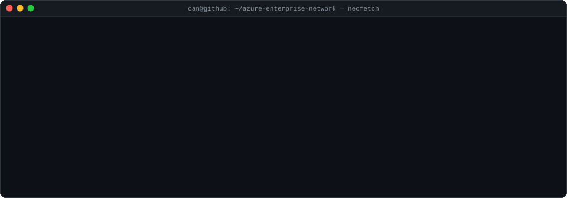
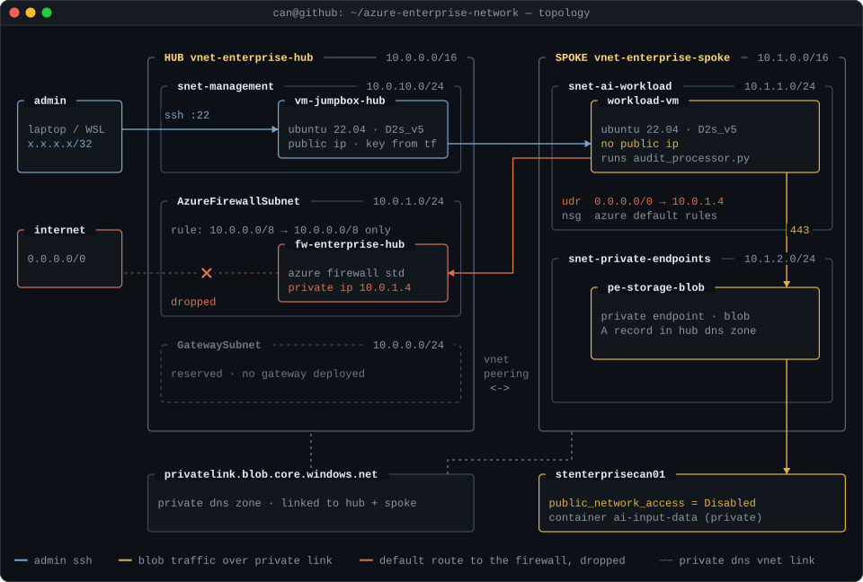
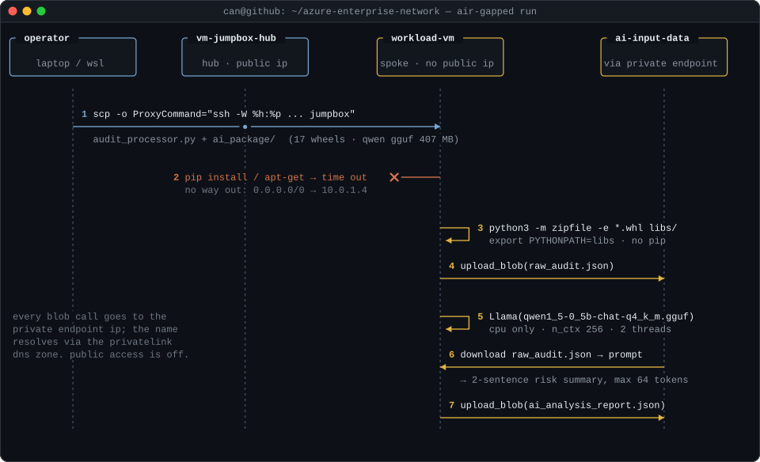

<p align="center">
  
</p>

A hub-spoke network on Azure, written in Terraform, built around one question: **can I run an AI job on a VM that has no way to reach the internet, and still get data in and out?**

The VM lives in a spoke with no public IP. Its default route ends at an Azure Firewall that only allows private traffic. It reads and writes blob storage through a private endpoint, and the only way to log in is SSH through a jumpbox in the hub. To prove the isolation works, I copy a small language model (Qwen1.5-0.5B) onto the VM by hand and run it there.

[](https://github.com/Elxeoo/azure-enterprise-network/actions/workflows/terraform.yml)

---

## Topology

<p align="center">
  
</p>

Who can talk to whom, and which resource decides it:

| From → to | Result | Decided by |
| :--- | :--- | :--- |
| My IP → `vm-jumpbox-hub` :22 | allowed | `nsg-management`, rule `Allow-SSH-Inbound`, source `admin_ip_range` |
| Any other IP → jumpbox | blocked | same NSG (no other inbound allow) |
| Jumpbox → `workload-vm` | allowed | VNet peering hub ⇄ spoke |
| `workload-vm` → blob storage | allowed, over a private IP | `pe-storage-blob` + private DNS zone `privatelink.blob.core.windows.net` |
| `workload-vm` → internet | **dropped** | route `0.0.0.0/0 → 10.0.1.4` sends it to `fw-enterprise-hub`, whose only rule allows `10.0.0.0/8 → 10.0.0.0/8` |
| Internet → storage account | refused | `public_network_access = "Disabled"` |

Blob traffic does not go to the firewall even though the subnet has a `0.0.0.0/0` route. A private endpoint adds a `/32` route for its own IP, and the most specific route wins.

---

## The air-gapped run

<p align="center">
  
</p>

[`src/audit_processor.py`](src/audit_processor.py) does five things on the VM:

1. Connects to the `ai-input-data` container. The connection string is read from an environment variable, never from the code.
2. Uploads a mock security event (`SEC-991`, severity High) as `raw_audit.json`.
3. Loads `qwen1_5-0_5b-chat-q4_k_m.gguf` with `llama-cpp-python` on CPU (`n_ctx=256`, 2 threads = the two vCPUs of a D2s_v5).
4. Downloads the event again and asks the model for a two-sentence risk summary (max 64 tokens).
5. Uploads the result as `ai_analysis_report.json`.

`pip` and `apt` can't work on this VM, because there is nowhere for them to go. Wheels are zip files, though, so the packages are unpacked with Python's built-in `zipfile` module and put on `PYTHONPATH`. The wheel set is pinned with hashes in [`src/offline-requirements.txt`](src/offline-requirements.txt). The wheels are built for CPython 3.10, which is what the Ubuntu 22.04 image ships.

---

## What I actually ran

- **17 Sep 2026: full deploy and the AI run.** The Terraform state from that day holds 31 resources. The VMs came up at `10.0.10.4` (jumpbox) and `10.1.1.4` (workload), and the private endpoint at `10.1.2.4`. The script ran on the workload VM, and then I destroyed everything.
- **That run happened before the firewall existed.** The route already pointed `0.0.0.0/0` at `10.0.1.4`, but nothing was deployed at that address, so outbound traffic went nowhere. The VM still had no internet access, but there was no policy and nothing that could log it. On 2 Oct I put a real Azure Firewall at that IP ([`bf5738c`](https://github.com/Elxeoo/azure-enterprise-network/commit/bf5738c)). CI validates that version, but it has **not been deployed yet**.
- **The model is the original file.** The local `qwen1_5-0_5b-chat-q4_k_m.gguf` has the same SHA-256 that Hugging Face publishes for it (`92916b71…fe1a3a`). [`download_offline_packages.sh`](src/download_offline_packages.sh) checks the model against that hash, and pip checks every wheel against its pinned hash.
- **Every push is checked.** [`terraform.yml`](.github/workflows/terraform.yml) runs `terraform fmt -check`, `init` and `validate`.

---

## Design decisions

**A firewall as the next hop, instead of an outbound NSG deny.** An NSG rule could also block egress. Putting the firewall at the end of the default route gives every spoke a single exit, and that is where an allow-list (for example an internal package mirror) would go later. The price: Azure Firewall Standard is billed per hour and is the most expensive resource in this lab.

**The private DNS zone lives in the hub and is linked to both VNets.** One zone can then serve any number of spokes. The private endpoint writes its own A record into it through `private_dns_zone_group`, so nothing is maintained by hand.

**SSH keys are generated by Terraform (`tls_private_key`).** No key files have to exist before deploying, which also makes the code CI-friendly. The trade-off is that the private keys are stored in plain text in `terraform.tfstate`, so the state file is a secret (see gaps).

**The wheels are unpacked, not installed.** `zipfile` skips pip's dependency resolver, so a missing dependency only shows up at import time. That is why the full set of 17 wheels is pinned with hashes, not just the two top-level packages.

**A tiny model on purpose.** The model is a 0.5B Q4_K_M GGUF of 407 MB. It fits in the 8 GiB of a D2s_v5 and runs on CPU. The point of the project is the network path, not the model.

---

## Known gaps / what I'd change next

- [ ] **Re-run the job on the firewall version** and record the result. The current proof comes from the black-hole route.
- [ ] **Send firewall logs to Log Analytics.** Right now a dropped connection leaves no trace anywhere.
- [ ] **Stop using the storage account key.** The script authenticates with a connection string (shared key enabled). The next step is a managed identity on `workload-vm` with a data-plane RBAC role.
- [ ] **Use the firewall's real IP in the route table.** `10.0.1.4` is hard-coded in the route. It should come from the firewall resource's private IP output.
- [ ] **Remote state.** State is local, and it contains both private keys. It should go into a storage account backend with locking.
- [ ] **Replace the jumpbox's public IP with Azure Bastion.** That trades cost for no public SSH endpoint.
- [ ] **Tighten `nsg-ai-workload`.** It only has Azure's default rules, so anything in the VNet can reach the workload. It should allow SSH from `snet-management` only.
- [ ] **`GatewaySubnet` is created but unused.**

---

## History

| Date | Change | Commit |
| :--- | :--- | :--- |
| 2026-09-16 | First hub-spoke version | [`856516d`](https://github.com/Elxeoo/azure-enterprise-network/commit/856516d) |
| 2026-09-17 | Split into `hub` / `spoke` modules, CI added, SSH keys generated by Terraform; deployed and ran the AI job | [`de7e61e`](https://github.com/Elxeoo/azure-enterprise-network/commit/de7e61e) · [`43bdc76`](https://github.com/Elxeoo/azure-enterprise-network/commit/43bdc76) · [`d6b7f3a`](https://github.com/Elxeoo/azure-enterprise-network/commit/d6b7f3a) |
| 2026-10-02 | Azure Firewall deployed at the route's next hop; jumpbox SSH limited from `*` to `admin_ip_range` | [`bf5738c`](https://github.com/Elxeoo/azure-enterprise-network/commit/bf5738c) |

---

## Run it yourself

You need the Azure CLI (`az login`), Terraform ≥ 1.8 and `jq`. Destroy the environment when you're done: the firewall and both VMs are billed by the hour.

```bash
git clone https://github.com/Elxeoo/azure-enterprise-network.git
cd azure-enterprise-network
terraform init
terraform apply -var="admin_ip_range=$(curl -s ifconfig.me)/32"
```

**1. Get the SSH keys out of the state**
```bash
jq -r '.resources[] | select(.type=="tls_private_key" and .name=="jumpbox_ssh")  | .instances[0].attributes.private_key_pem' terraform.tfstate > hub_key.pem
jq -r '.resources[] | select(.type=="tls_private_key" and .name=="workload_ssh") | .instances[0].attributes.private_key_pem' terraform.tfstate > spoke_key.pem
chmod 400 hub_key.pem spoke_key.pem
JUMP=$(terraform output -raw jumpbox_public_ip)
VM=$(terraform output -raw workload_private_ip)
```

**2. Stage the offline packages** (on your machine, which has internet access; about 450 MB)
```bash
./src/download_offline_packages.sh
```

**3. Copy everything in through the jumpbox**
```bash
PROXY="ssh -W %h:%p -i hub_key.pem azureuser@$JUMP"
scp -o ProxyCommand="$PROXY" -i spoke_key.pem src/audit_processor.py azureuser@$VM:~
scp -o ProxyCommand="$PROXY" -i spoke_key.pem -r ai_package azureuser@$VM:~
ssh -o ProxyCommand="$PROXY" -i spoke_key.pem azureuser@$VM
```

**4. On the workload VM**
```bash
mkdir libs && for f in ai_package/*.whl; do python3 -m zipfile -e "$f" libs/; done
export PYTHONPATH="$PWD/libs"
export AZURE_STORAGE_CONNECTION_STRING="<from: az storage account show-connection-string -n stenterprisecan01 -g rg-enterprise-spoke>"
python3 audit_processor.py
```

**5. Tear down**
```bash
terraform destroy
```

---

## Repository layout

```text
.
├── main.tf                 # hub + spoke modules, VNet peering, private DNS VNet links
├── variables.tf            # region, address spaces, storage account name, admin_ip_range
├── outputs.tf              # jumpbox public IP, workload private IP, blob endpoint, container name
├── providers.tf            # Terraform >= 1.8, azurerm >= 4.0, tls >= 4.0
├── modules/
│   ├── hub/                # firewall + rule, jumpbox + NSG, private DNS zone
│   └── spoke/              # workload VM + NSG, route table, storage account, private endpoint
├── src/
│   ├── audit_processor.py           # the job that runs on the air-gapped VM
│   ├── download_offline_packages.sh # stages wheels + model, hash-checked
│   └── offline-requirements.txt     # the exact 17 wheels, pinned with sha256
├── docs/diagrams/          # the SVGs in this README
└── .github/workflows/terraform.yml
```

---

<sub>Part of a three-project series: **azure-enterprise-network** · [aks-cilium-ebpf-lab](https://github.com/Elxeoo/aks-cilium-ebpf-lab) · [enterprise-gitops-argocd](https://github.com/Elxeoo/enterprise-gitops-argocd) · MIT licensed</sub>
